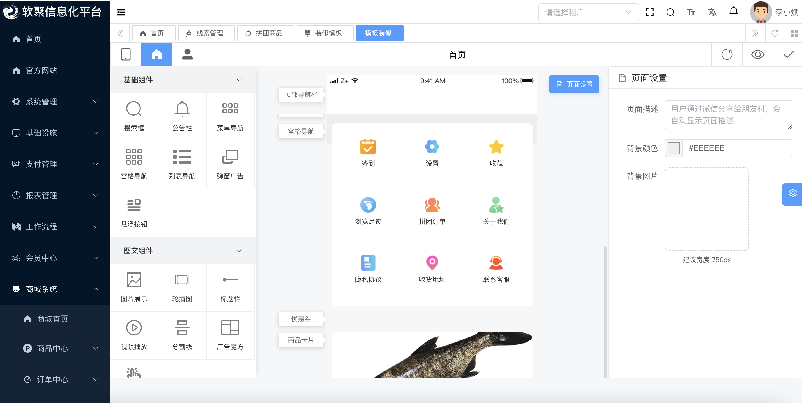

## 安装环境

* nodejs > 16.18.0 && pnpm > 8.6.0 (强制使用pnpm)

## 在线体验
* 体验地址: https://elm.softfoucs.cn (账号密码已默认)
* 文档地址: https://docs.softfoucs.cn

## 启动 

* [前端说明](https://docs.softfoucs.cn/frontend.html)
* 克隆 https://github.com/starrystar-tech/elm-frontend.git 项目，并 Star 关注下该项目。

* 在目录下执行如下命令，进行启动：
```sh
# 安装 pnpm，提升依赖的安装速度
npm config set registry https://registry.npmmirror.com
npm install -g pnpm
# 安装依赖
pnpm install

# 启动服务
npm run dev

```
* 启动完成后，在浏览器中访问 http://localhost 即可, 如下图示例


## 讨论群聊
如软聚信息化平台搭建过程中遇到任何问题，欢迎加入交流群，我们将及时为您解答与支持。
[](https://file.bgwa.cn/bgwa/groupchat.jpg)

## 联系我们
我们专业提供CRM、ERP、电商平台等企业信息化系统的定制开发服务，助力企业高效管理与数字化转型。

联系我们<br>
QQ: 516908542@qq.com <br>
微信号: lixiaobin9959 <br>
[](https://file.bgwa.cn/bgwa/cooperation.jpg) 

## 项目地址
后端: https://github.com/starrystar-tech/elm-backend
前端: https://github.com/starrystar-tech/elm-frontend
文档: https://github.com/starrystar-tech/elm-docs 

## 平台简介

软聚专注于企业信息化建设，深度融合AI技术，赋能数字化转型，驱动企业智慧升级。截图如下：


流程管理


ERP

 
CRM系统


商城系统


